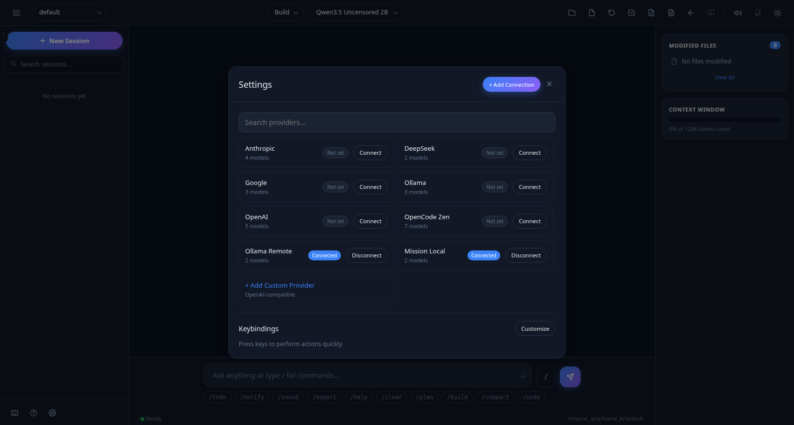
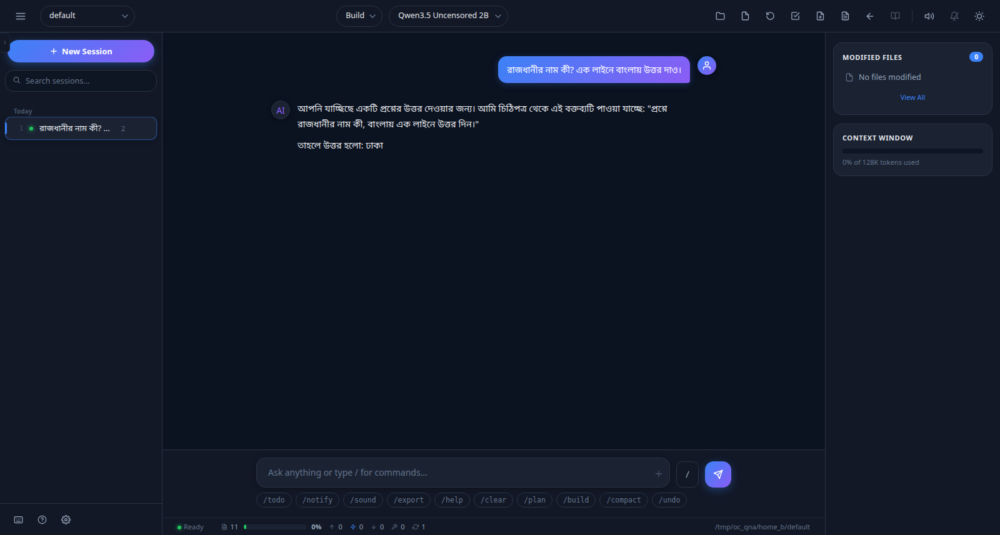
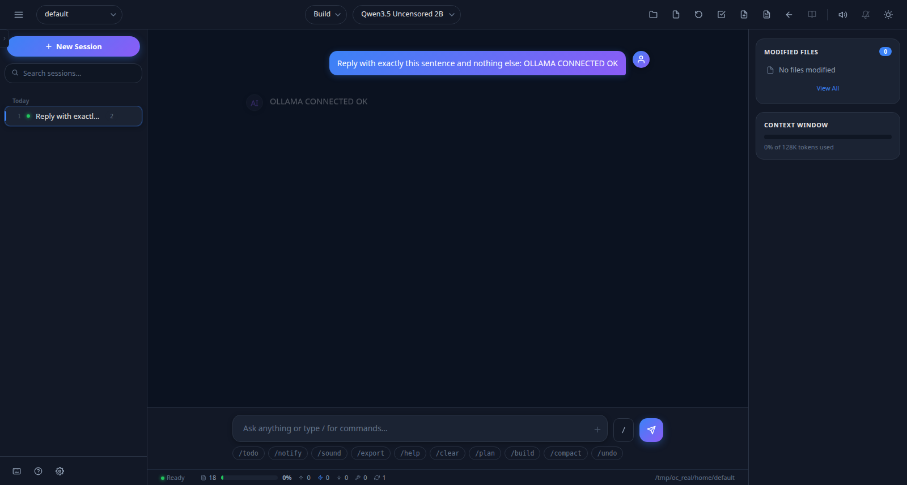
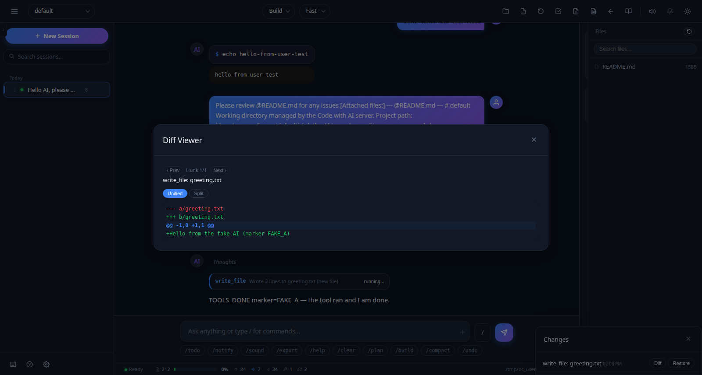
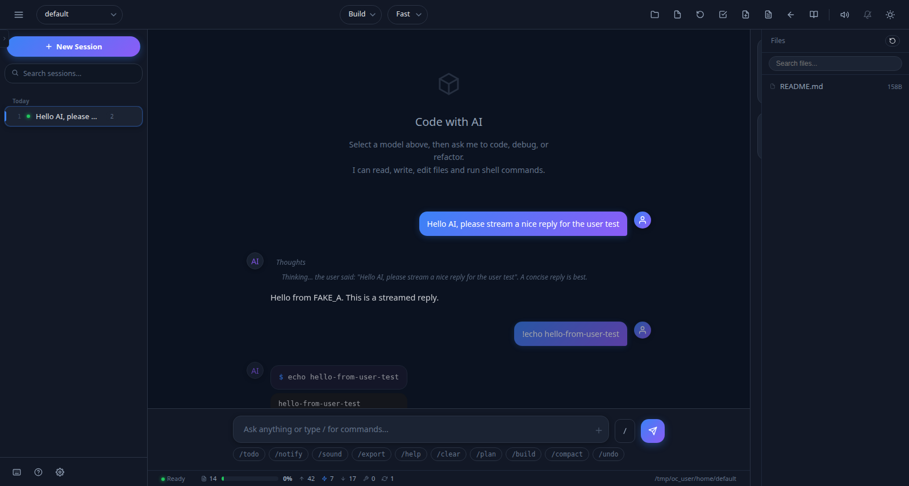
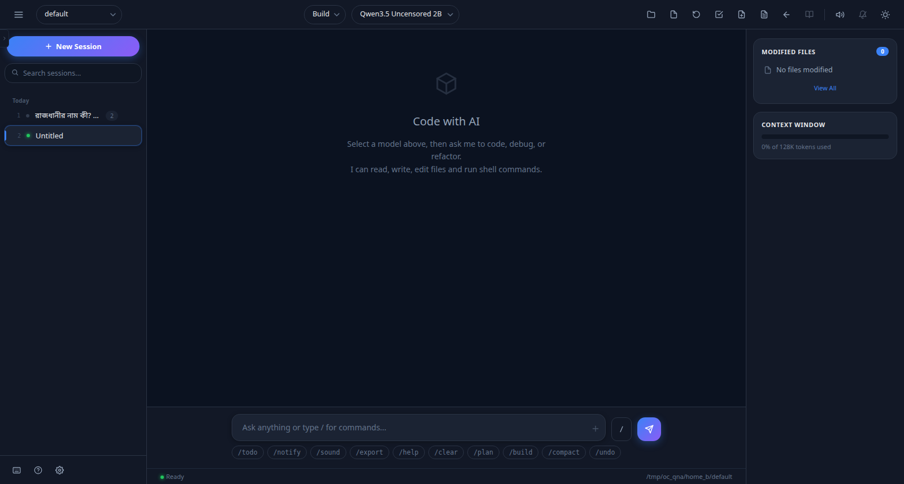

# Code with AI — Node.js Backend (Contract-First Rebuild)

> এই রিপোতে পুরো **UI + ব্যাকএন্ড** একসাথে আছে: মূল `index.php` UI অক্ষত (০ এডিট),
> আর তার সার্ভার-সাইড রেন্ডারার হিসেবে **Node.js-এর শুধু বিল্ট-ইন মডিউল** দিয়ে
> পুনর্নির্মিত ব্যাকএন্ড — কোনো runtime dependency নেই (`npm install` লাগে না)।

| সূত্র | অবস্থা |
|---|---|
| `index.php` md5 | `895eb75226cc2801834baaced2873bb1` — ৬,৪৯০ লাইন / ৩১০,২৩৩ বাইট, **০ এডিট** |
| কনট্রাক্ট | ৩৯টি রাউট + ১২টি স্ট্রিম-ইভেন্ট — বাইট-লেভেল যাচাই |
| টেস্ট ফল | contract **১১/১১** · user **১১/১১** · real-provider **১৩/১৩** · operator-Q&A **১৮/১৮** |
| `<?php` ব্লক | ০টি — তাই এটি শুধু Node সার্ভার দিয়েই সার্ভ হয় |



---

## Features

- **Contract-first**: প্রতিটি রাউট/প্যারামিটার/ইভেন্ট `index.php` থেকে নিষ্কাশিত ও টেস্টে বাধ্যতামূলক
- **শুধু Node built-in** — `child_process`, `http`, `fs`, `crypto`, `net`, `path`
- **ওপেন-সোর্স-কম্প্যাট প্রোভাইডার**: OpenAI-স্টাইল endpoint + Ollama/Mission-সহ যেকোনো gateway
- **স্ট্রিমিং ইঞ্জিন**: টুল-কল লুপ, পারমিশন মোডাল, টুডু, টাইটেল-জেনারেশন, usage/cost
- **জেইলড ওয়ার্কস্পেস**: ফাইল/শেল অ্যাক্সেস কডের ভেতরেই `OC_ROOTS`-এ সীমাবদ্ধ (প্যাথ-ট্রাভার্সাল টেস্টসহ)
- **`.env` কনফিগ**: কোনো সোর্স-কোড হাত-লাগানো ছাড়াই প্রোভাইডার/মডেল/পোর্ট/টোকেন
- **স্বচ্ছ লগ**: `logs/server.log` (http/llm/env/boot, secret রিড্যাক্ট, `run_id=`) + `logs/console.log`



---

## Requirements

- **Node.js ≥ 18** (যেকোনো OS; এই রিপো যাচাই হয়েছে Node 24, Linux-এ)
- ইন্টারনেট/নেটওয়ার্ক অ্যাক্সেস — যদি বাস্তব LLM প্রোভাইডার ব্যবহার করেন (ঐচ্ছিক; ছাড়াও চলে)
- `git` (ক্লোনের জন্য)

## Quick start — Git clone থেকে ব্যবহার পর্যন্ত

### Linux / macOS (bash)

```bash
# 1) ক্লোন
git clone https://github.com/sahonsrabon-os/Mission-Barisal-Frontend.git
cd Mission-Barisal-Frontend

# 2) কনফিগ (একবার) — প্রোভাইডার/পোর্ট শুধু এখানেই
cp .env.example .env
#   .env সম্পাদনা করুন: PORT, HOST, OC_PROVIDER_* (নমুনা দেখুন .env.example)
chmod 600 .env

# 3) চালু
node start.js           # বা: npm start  /  ./start.sh  (তিনটিই একই)
#   প্রতি রানে নতুন run_id (random UUID) তৈরি হয়; ডাবল-স্টার্ট/পোর্ট-দ্বন্দ্বে
#   স্ক্রিপ্ট ব্লক করে না — চলমান ইনস্ট্যান্স দেখিয়ে বেরিয়ে আসে।

# 4) ব্রাউজারে খুলুন
#   http://127.0.0.1:8787/     (PORT/HOST অনুযায়ী .env-এ)

# 5) বন্ধ
node stop.js             # বা: ./stop.sh
```

### Windows (PowerShell)

```powershell
# 1) ক্লোন
git clone https://github.com/sahonsrabon-os/Mission-Barisal-Frontend.git
cd Mission-Barisal-Frontend

# 2) কনফিগ (একবার)
Copy-Item .env.example .env
notepad .env             # PORT, HOST, OC_PROVIDER_* সম্পাদনা

# 3) চালু
node start.js            # বা: npm start
#    (cmd থাকলেও একই: node start.js)

# 4) ব্রাউজারে: http://127.0.0.1:8787/

# 5) বন্ধ
node stop.js
```

> **সৎ নোট:** লঞ্চার ও সার্ভার শুধু Node built-in ব্যবহার করে তাই প্ল্যাটফর্ম-নিরপেক্ষ;
> তবে এই রিপোর সব প্রমাণ ও টেস্ট এই সেশনে **Linux-এ সত্যিই চালিয়ে** নেওয়া —
> উইন্ডোজে চালিয়ে যাচাই করা হয়নি। উইন্ডোজ-ধাপগুলো Node-এর আদর্শ ব্যবহারের উপর ভিত্তি করে লেখা।

## Configuration (`.env`)

| কী | অর্থ | উদাহরণ |
|-----|------|---------|
| `PORT` / `HOST` | HTTP পোর্ট/বাইন্ড (ডিফল্ট পোর্ট `18800`) | `PORT=8787`, `HOST=0.0.0.0` (LAN/টানেল) |
| `OC_PROVIDER_<n>_NAME` | প্রোভাইডারের নাম | `Mission Local` |
| `OC_PROVIDER_<n>_BASE_URL` | OpenAI-স্টাইল base | `https://example.com/v1` |
| `OC_PROVIDER_<n>_API_KEY` | বেয়ারার কী (খালি রাখা যায়) | `sk-...` |
| `OC_PROVIDER_<n>_MODELS` | `id=নাম,id2=নাম2` | `mission=Mission Pilot` |
| `OC_PROVIDER_<n>_MODEL` | ডিফল্ট মডেল (UI অটো-সিলেক্ট করে) | `mission` |
| `OC_ACCESS_TOKEN` | সেট থাকলে সব API/স্ট্রিম টোকেন-গেট | — |
| `OC_ROOTS` | অতিরিক্ত অনুমোদিত রুট (`:`-বিভাজিত) | — |
| `OC_LOG_FILE` / `OC_PROVIDERS_FORCE` / `OC_ENV_FILE` | লগ-পাথ / সিড ওভাররাইট / `.env` বন্ধ | — |

**প্রাধান্যক্রম:** আসল এনভায়রনমেন্ট ভেরিয়েবল > `.env` ফাইল > বিল্ট-ইন ডিফল্ট
(যাচাই: `unnecessary/evidence/P8/QA_RESULTS.json` Q6.1)। সিড-করা প্রোভাইডার প্রথমবার
তৈরি হয়; UI-তে আগে থেকে সম্পাদিত এন্ট্রি অক্ষত থাকে (`OC_PROVIDERS_FORCE=1` ছাড়া)।

`.env` কখনো কমিট হয় না (`.gitignore`-এ আছে) — `.env.example` নমুনা হিসেবে থাকে।

## Logging & runs

- `logs/server.log` — টাইমস্ট্যাম্পসহ `http`/`llm`/`env`/`boot` লাইন, secret রিড্যাক্ট
- `logs/console.log` — সার্ভারের কাঁচি stdout/stderr
- `logs/server.pid` + `logs/last-run.json` — চলমান প্রসেস ও **প্রতি রানের random UUID**
- বুট-লাইনে `run_id=<uuid>` থাকে — একই দিনের একাধিক রান পাশাপাশি লগে আলাদা করা যায়

```bash
tail -f logs/server.log     # অ্যাপ লগ
tail -f logs/console.log    # কাঁচি আউটপুট
```

## Testing

সব টেস্ট শুধু Node দিয়ে চলে (Chrome CDP-তে UI ক্লিক-থ্রু; রিয়েল-প্রোভাইডার টেস্ট ঐচ্ছিক):

```bash
npm test                    # contract + user (দ্রুত, নিয়ন্ত্রিত ফেক-প্রোভাইডার)
npm run test:contract       # ৩৯ রাউট + ১২ ইভেন্ট কনট্রাক্ট      -> ১১/১১
npm run test:user           # U* UI ক্লিক-থ্রু                    -> ১১/১১
npm run test:real           # R* আসল ngrok-Ollama + Mission চ্যাট -> ১৩/১৩
npm run test:qna            # Q* অপারেটর প্রশ্ন-তদন্ট             -> ১৮/১৮
```

প্রমাণ সব (`evidence`, স্ক্রিনশটসহ) `unnecessary/evidence/`-এ — ফল-টেবিল:
`docs/test_plan.md`।









## Deployment notes

- **শুধু Node দিয়ে সার্ভ করুন** — `index.php`-তে `<?php` নেই, PHP-FPM/cPanel-এ সরাসরি
  সার্ভ করলে ফাইল ডাউনলোড হবে/ব্ল্যাঙ্ক আসবে। cPanel-হোস্টে Node app (Passenger/LSM)
  চালান, বা টানেল (ngrok/cloudflared) সামনে রাখুন।
- API কল **সেম-ওরিজিন রিলেটিভ পাথ** (`ai_php_api.php`) — তাই LAN IP বা পাবলিক
  টানেল-ওরিজিন থেকেও ঠিক একভাবেই কাজ করে (যাচাই: `unnecessary/evidence/P8/Q6_lan_origin.png`)।
- পাবলিক টানেল চালু রাখলে `HOST=0.0.0.0` + `OC_ACCESS_TOKEN` সেট করুন এবং
  `.env`/লগ কখনো শেয়ার করবেন না।

## Project structure

```
.
├── index.php                 # মূল UI — অক্ষত কনট্রাক্ট-সোর্স (md5 যাচাই টেস্টে)
├── server/
│   ├── server.js             # HTTP সার্ভার + রাউট-ডিসপ্যাচ + healthz
│   ├── lib/                  # env, log, providers, stream(ইঞ্জিন), routes, store, jail, ...
│   ├── test/                 # contract / user / real_provider / qna টেস্ট
│   └── README.md             # আর্কিটেকচার ও রাউট-স্তরের ডক
├── start.js / stop.js        # ক্রস-প্ল্যাটফর্ম লঞ্চার (run_id UUID; ব্লক করে না)
├── start.sh / stop.sh        # সুবিধার্থে র‍্যাপার (একই কাজ)
├── package.json              # npm start / npm test স্ক্রিপ্ট (dependency নেই)
├── .env.example              # কনফিগ-নমুনা  (.env কমিট হয় না)
├── docs/                     # ডকুমেন্ট + README-র স্ক্রিনশট
│   ├── test_plan.md          # পূর্ণ টেস্ট-ম্যাট্রিক্ও ও সৎ ফল-ইতিহাস
│   ├── QUESTIONS_AND_ANSWERS.md
│   └── images/
└── unnecessary/              # পরিকল্পনা/কাজের ফাইল — প্রোডাক্ট-কোড নয়
    ├── evidence/             # সব প্রমাণ: টেস্ট-রেজাল্ট JSON/MD, স্ক্রিনশট, রান-লগ
    ├── extract_contract.py   # কনট্রাক্ট-নিষ্কাশন টুল
    └── *.html / Plain Text.txt   # আগের ফরেনসিক-বিশ্লেষণ
```

## Documentation

- **[docs/test_plan.md](docs/test_plan.md)** — টেস্ট-পরিকল্পনা, ফল-লগ, পাওয়া-ও-সমাধানকৃত সমস্যার সৎ ইতিহাস
- **[docs/QUESTIONS_AND_ANSWERS.md](docs/QUESTIONS_AND_ANSWERS.md)** — অপারেটরের ৭টি প্রশ্ন, প্রতিটি *করে দেখে* উত্তর + ফল-টেবিল (১৮/১৮)
- **[server/README.md](server/README.md)** — আর্কিটেকচার, ৩৯ রাউট, কনফিগ-টেবিল, সমস্যা-সমাধান

## Integrity statement

এই রিপোর সব দাবি `unnecessary/evidence/`-এর প্রমাণ-ফাইল দিয়ে যাচাইযোগ্য; কোনো ফল
উদ্ভাবন করা হয়নি। `index.php` কোনো কমিটেই সম্পাদিত হয়নি (প্রতিটি টেস্ট-রান md5
পুনরায় যাচাই করে — সর্বশেষ: `895eb75226cc2801834baaced2873bb1`)।
